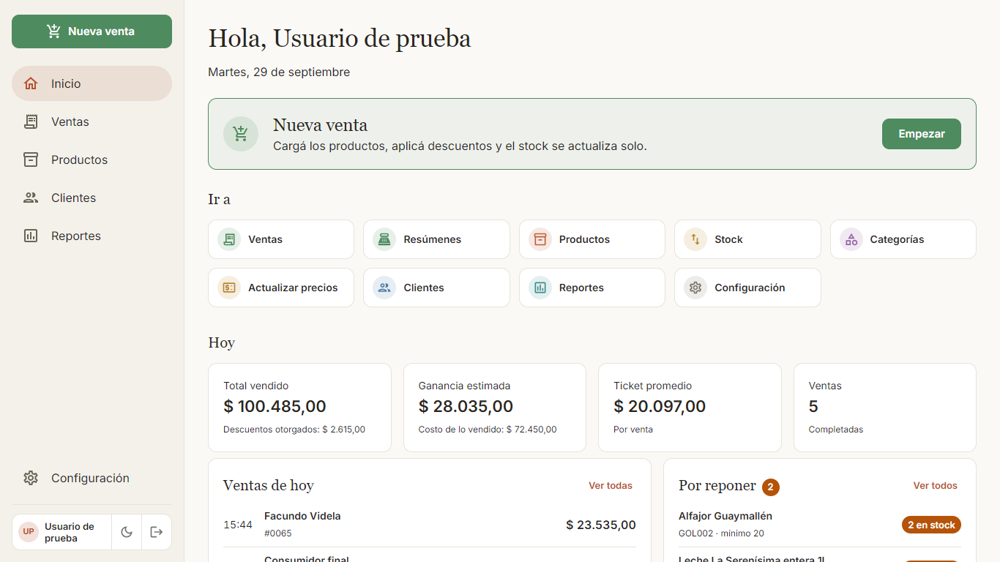
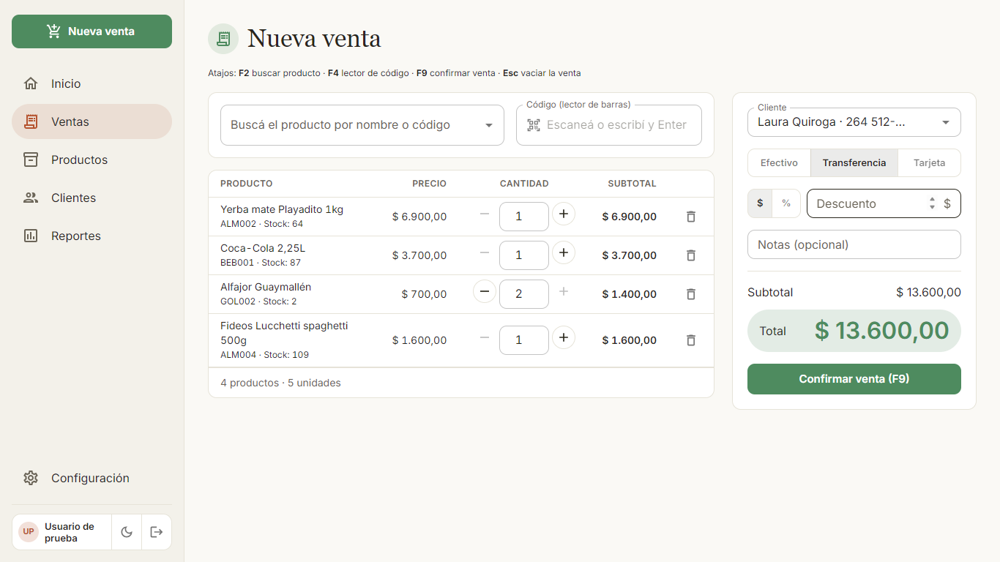
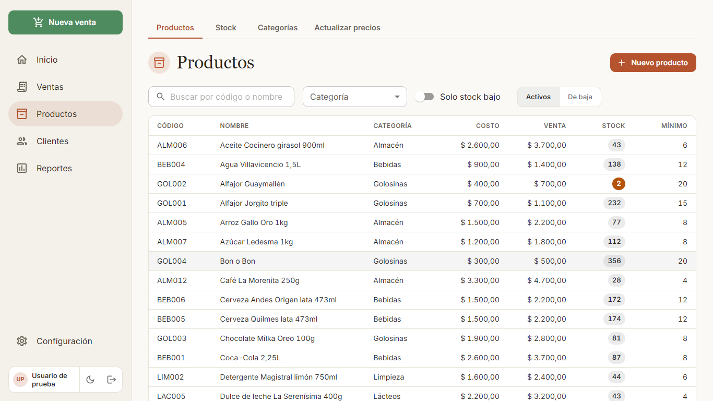
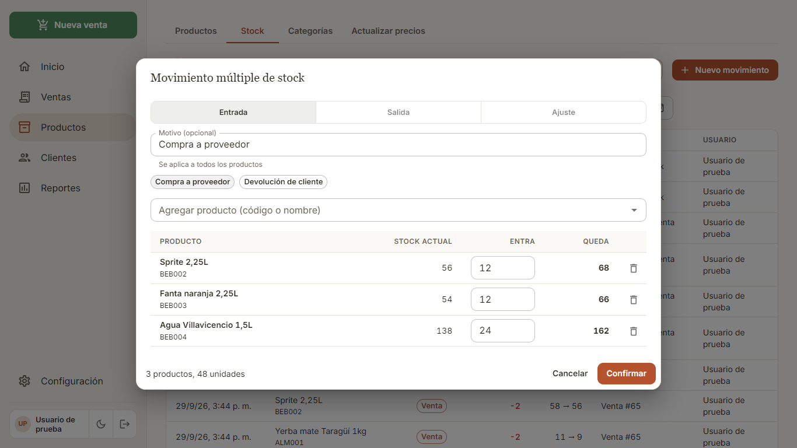
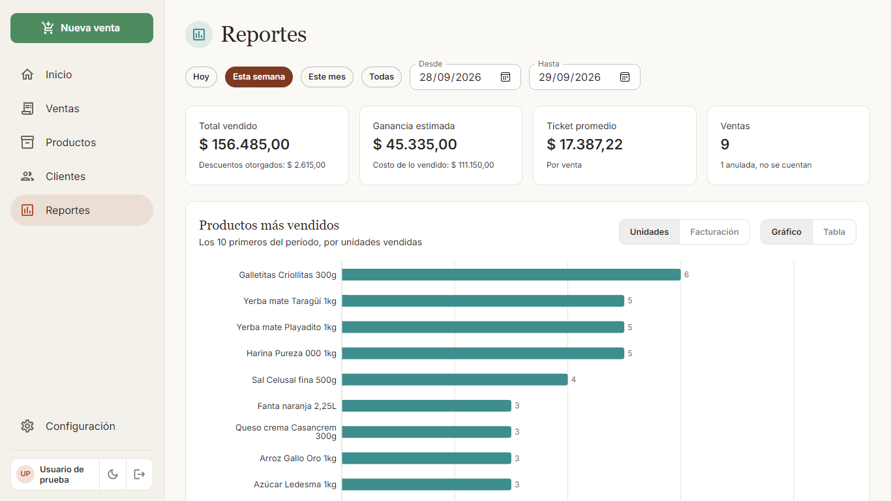
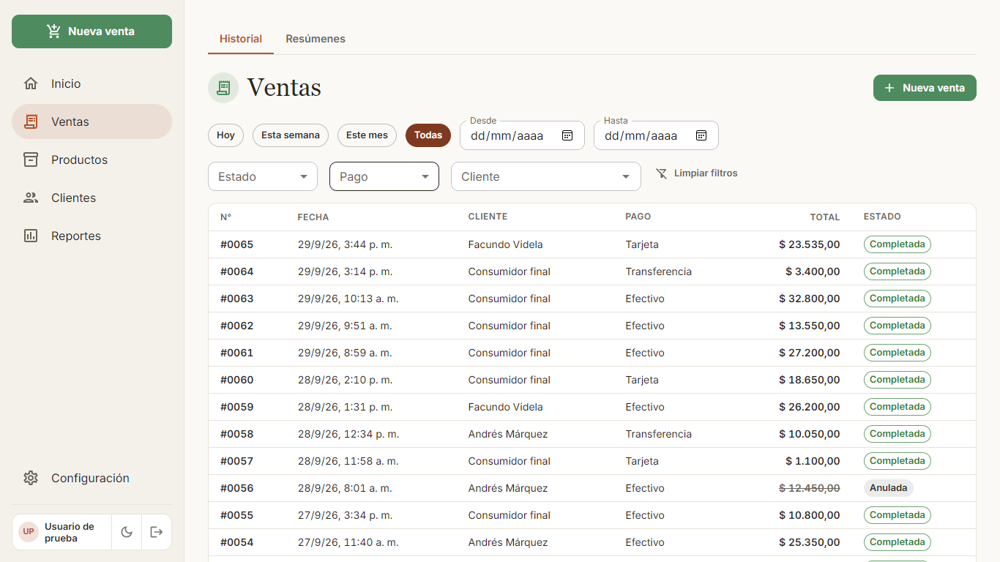
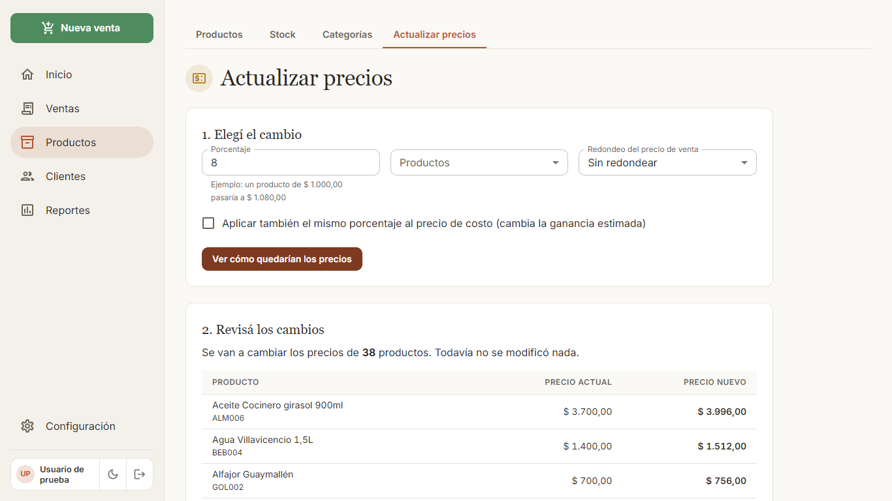
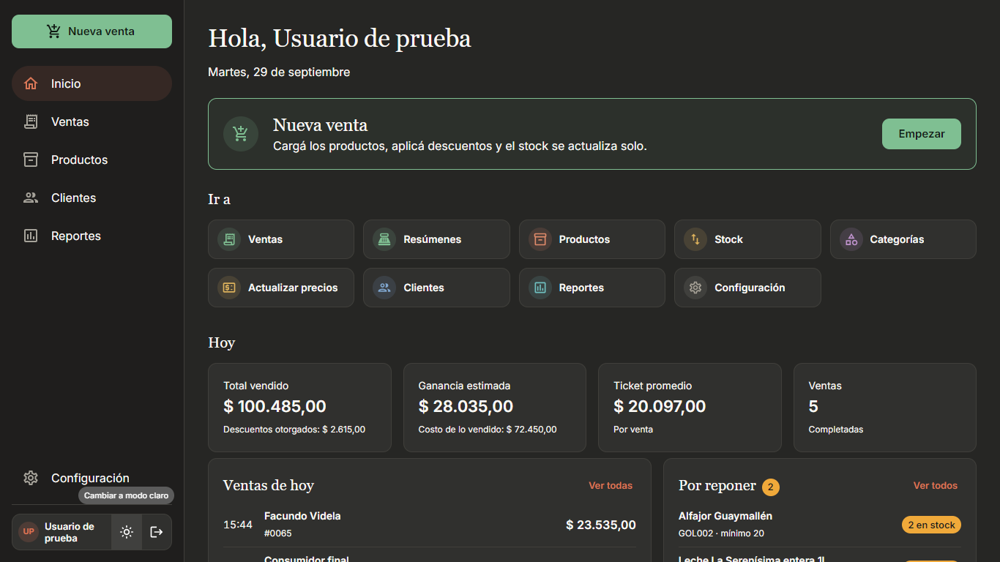

# Mercadería Guajardo

Sistema de **control de stock y ventas** para un comercio, con **aplicación de escritorio para Windows**.
Registra productos, ventas, movimientos de stock y clientes, genera comprobantes en PDF y permite ver reportes del negocio.
Funciona sin internet, guarda todo en un único archivo local y se actualiza sola desde GitHub.

<p align="center">
  
  
</p>

## Funcionalidades

### Ventas
- Una venta con **varios productos**, descuento por monto o porcentaje, medio de pago (efectivo, transferencia o tarjeta), cliente opcional y notas.
- **Descuenta el stock automáticamente**, todo o nada: si un producto no alcanza, no se guarda nada.
- Precios y costos salen siempre de la base de datos (nunca del navegador) y cada venta guarda una copia de nombre, precio y costo, así los cambios de precio no alteran el historial.
- Las ventas **no se editan, se anulan**, y anular devuelve el stock.
- Atajos de teclado (`F2` buscar, `F4` lector de códigos, `F9` confirmar, `Esc` vaciar) y soporte para lector de códigos de barras.
- Historial con filtros por período, estado, medio de pago y cliente, orden por columna y paginación desde el servidor.

### Comprobantes
- PDF con numeración propia (`0001-00000012`), datos del negocio en el encabezado y la leyenda *"Comprobante no válido como factura"*.
- Impresión directa desde la aplicación y **envío por WhatsApp** (el PDF queda copiado y se pega en el chat).

### Productos y stock
- Alta y edición con código, categoría, precio de costo y de venta, stock y stock mínimo. **Baja lógica** (nunca se borran).
- Código automático (`P00001`, `P00002`…) o el del lector de códigos de barras.
- Búsqueda que **ignora mayúsculas y tildes** ("taragui" encuentra "Taragüí"), filtros por categoría y por stock bajo.
- Cada entrada, salida o ajuste queda registrado: quién, cuándo, cuánto, el saldo antes y después, y el motivo.
- **Movimiento múltiple**: carga o descuenta stock de hasta 200 productos en un solo paso, todo o nada.
- **Actualización masiva de precios** por porcentaje, a todos los productos o a una categoría, con redondeo, vista previa, historial y **deshacer**.

<p align="center">
  
  
</p>

### Clientes
- Alta, edición y baja, con aviso si el teléfono ya existe y búsqueda por nombre, teléfono o email (incluso escribiendo solo los dígitos del teléfono).
- Contacto por **WhatsApp**: código QR para abrirlo desde el celular o chat directo en la computadora.

### Reportes y resúmenes
- Total vendido, ganancia estimada, ticket promedio y cantidad de ventas por período (hoy, semana, mes, todo el historial o un rango).
- Productos más vendidos (gráfico o tabla, por unidades o por facturación), medios de pago, mejores clientes y productos con stock bajo.
- **Resúmenes** imprimibles con el total cobrado por medio de pago; los descuentos y las ventas anuladas van aparte.

<p align="center">
  
  
</p>

### Configuración y seguridad de los datos
- **Copias de seguridad**: una automática por día al abrir, manuales cuando se quiera, restauración con un clic y **copia externa opcional** (pendrive o carpeta de la nube).
- Antes de restaurar o de actualizar la base se guarda una copia del estado actual.
- Un solo usuario con contraseña; datos del negocio para el comprobante; **modo claro y oscuro**.
- **Modo de prueba**: la aplicación se reinicia con datos de ejemplo (una base separada) para mostrarla sin tocar los datos reales, y se puede volver a los datos propios o empezar de cero.

<p align="center">
  
  
</p>

## Aplicación de escritorio

El comercio usa una PC con **Windows 8.1 de 32 bits y 2 GB de RAM**, por lo que la aplicación se empaqueta con
**Electron 22** (la última versión compatible con Windows 8.1) en **32 bits**: un único instalador sirve para Windows 8.1, 10 y 11, de 32 y de 64 bits.

- El servidor (Express) corre dentro de la propia aplicación y la interfaz se abre en una ventana; los datos viven en `%APPDATA%\Mercadería Guajardo`, fuera del programa, así que actualizar o desinstalar no los borra.
- **Se actualiza sola**: al abrir busca la última versión en *GitHub Releases* (`electron-updater`).
- Cada versión se compila, se prueba y se publica con **GitHub Actions** al subir una etiqueta `vX.Y.Z`.
- La ventana solo carga contenido propio; la de WhatsApp está aislada y solo puede abrir `web.whatsapp.com`.

Además, `tools/whatsapp` es un pequeño programa aparte (WhatsApp Web liviano para la PC vieja) que la aplicación puede usar para abrir los chats.

## Decisiones técnicas

- **El stock cambia por un único camino**: toda modificación pasa por una función que deja un movimiento; además la base tiene `CHECK (stock >= 0)`. Nunca se edita a mano.
- **Ventas transaccionales**: una sola transacción por venta, y los productos se procesan siempre en orden de id para evitar cruces entre ventas simultáneas (hay pruebas con ventas en paralelo).
- **Dinero en centavos enteros** (`INTEGER`), nunca `float`.
- **SQLite con cola de transacciones**: SQLite trabaja con un grupo de 4 hilos y varias transacciones esperando el candado de escritura lo traban; por eso las transacciones se ponen en fila.
- **Migraciones versionadas** que se aplican solas al arrancar, con backup previo si la base ya tenía datos.
- **Búsqueda sin tildes** dentro de SQLite (que no la trae) con un límite conocido de `REPLACE` anidados, vigilado por una prueba.
- **Validación siempre en el servidor**, aunque la interfaz también valide. La API se prueba con entradas absurdas: ninguna puede producir un error 500 y sin sesión no se accede a ninguna ruta privada.
- **Arquitectura por capas**: `routes → handlers → controllers → models`. Los controllers no conocen el pedido HTTP.
- Sesión con **JWT en cookie `httpOnly`**, contraseñas con `bcryptjs` y CORS restringido al origen de la interfaz.

## Tecnologías

| Parte | Tecnología |
|---|---|
| Interfaz | React 19, Vite, Material UI, React Router, Redux Toolkit (solo la sesión), Axios, Recharts |
| Comprobantes | jsPDF + jspdf-autotable (PDF en el navegador) |
| Servidor | Node.js, Express 5, Sequelize |
| Base de datos | SQLite (`sqlite3` 5.1.7, con binarios de 32 bits) |
| Escritorio | Electron 22, electron-builder, electron-updater |
| Pruebas y calidad | `node --test` (121 pruebas), ESLint, GitHub Actions |

## Estructura

```
mercaderia-guajardo/
  client/     Interfaz (React + Vite): una carpeta por módulo en src/features
  server/     API (Express): routes, handlers, controllers, models, migrations y pruebas
  desktop/    Aplicación de escritorio (Electron) y empaquetado del instalador
  tools/      Herramientas aparte (WhatsApp liviano)
  docs/       Capturas de pantalla
```

## Cómo ejecutarlo en desarrollo

Requisitos: **Node.js 20.19 o superior** (se desarrolló con la 22).

```bash
# 1) Servidor
cd server
npm install
cp .env.example .env        # completar JWT_SECRET con un texto largo y aleatorio
npm run dev                 # http://localhost:3001 (aplica las migraciones solo)

# 2) Interfaz (en otra terminal)
cd client
npm install
npm run dev                 # http://localhost:5173
```

Al abrir la aplicación por primera vez pide crear el usuario. Para cargar datos de ejemplo:

```bash
cd server
npm run seed                # categorías, productos y clientes (necesita al menos un usuario)
```

O para probar todo con una demostración completa (usuario `demo`, contraseña `demo1234`, ventas de las últimas dos semanas):

```bash
# bash
APP_MODE=demo DB_FILE=./data/demo.sqlite npm start
# PowerShell
$env:APP_MODE="demo"; $env:DB_FILE="./data/demo.sqlite"; npm start
```

### Pruebas y calidad

```bash
cd server && npm test       # 121 pruebas con una base temporal
cd server && npm run lint
cd client && npm run lint && npm run build
```

Las pruebas también se pueden correr dentro del Node de Electron 22 (el de la PC del negocio) con `TEST_NODE_BIN=<ruta a electron.exe>`.

### Otros comandos del servidor

`npm run backup` · `npm run restore` · `npm run migrate` · `npm run create-user` · `npm run load-test` (carga miles de ventas para medir la velocidad).

### Compilar el instalador

```bash
cd client && npm run build
cd ../desktop && npm install
npm start                   # abre la aplicación de escritorio
npm run dist                # genera el instalador de Windows en desktop/dist
```

Para publicar una versión: cambiar `version` en `desktop/package.json`, crear la etiqueta `vX.Y.Z` y subirla; GitHub Actions compila, prueba y publica el instalador.

## Licencia

Proyecto personal. Todos los derechos reservados.
